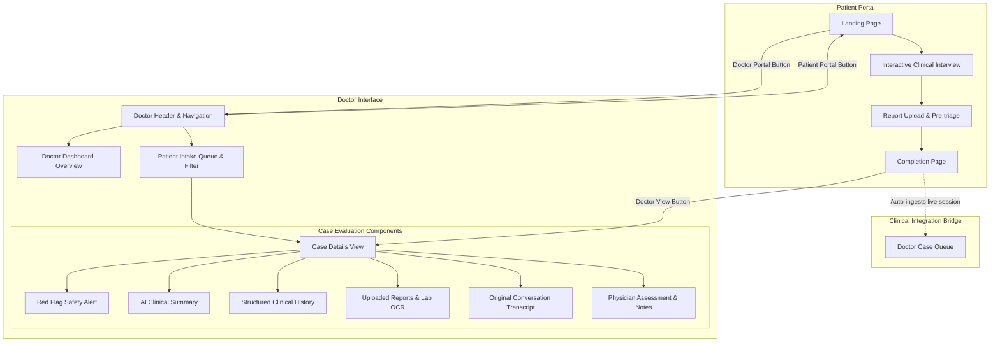

# Arogya AI — Doctor Interface Implementation Walkthrough

We have added a comprehensive, professional **Doctor Interface & Clinical Dashboard** to the existing **Arogya AI (आरोग्य AI)** application, while preserving the existing **Patient Interface** and adhering to all clinical safety and architectural standards.

---

## 1. System Architecture & Flow

The unified application supports both the **Patient Interface** and the new **Doctor Interface**:

---

## 2. Key Components Built

### 1. Centralized Data Architecture
- [`mockCases.js`](file:///C:/Users/user/Downloads/ArogyaAI-Patient-System/src/data/mockCases.js):
  - Standardized schema: `patient`, `intakeId`, `chiefComplaint`, `hasRedFlags`, `redFlags`, `aiSummary`, `structuredHistory`, `messages`, `reports`, `doctorNotes`, `provisionalDiagnosis`, `reviewStatus`.
  - Realistic cases include **Ramesh Kumar (MED-94021)** (high fever, chills, CBC report with microcytic anemia and leukocytosis, potential red flag), **Priya Sharma (MED-81204)** (unilateral headache, no red flags), **Vikram Singh (MED-63119)** (hypertensive cough, chest X-ray), and **Sunita Patel (MED-52018)** (dyspepsia, fasting glucose report).
  - Doctor profile: **Dr. Ananya Sharma, MD (General Medicine)**.

### 2. State Management & Live Session Sync
- [`DoctorContext.jsx`](file:///C:/Users/user/Downloads/ArogyaAI-Patient-System/src/context/DoctorContext.jsx):
  - Manages `cases`, `activeDoctorView` (`'dashboard' | 'cases' | 'details'`), search query, and filter tabs (`'all' | 'red-flags' | 'needs-review' | 'reviewed'`).
  - Actions: `selectCase`, `updateDoctorNotes`, `markCaseReviewed`, `acceptCase`, `exportCaseReport`.
  - Dynamic Ingestion (`ingestPatientCase`): When a patient finishes an interview in the Patient Interface, that case is automatically converted into a structured clinical record and added to the top of the Doctor Queue in real-time.

### 3. Doctor Dashboard & Overview
- [`DoctorDashboardStats.jsx`](file:///C:/Users/user/Downloads/ArogyaAI-Patient-System/src/components/doctor/DoctorDashboardStats.jsx):
  - 4 High-level metric cards: *Total Intakes*, *Needs Review*, *Potential Red Flags*, and *Reviewed / Accepted*.
  - Priority Safety Screening banner highlighting cases with potential red flags.

### 4. Patient Intake Queue
- [`CaseList.jsx`](file:///C:/Users/user/Downloads/ArogyaAI-Patient-System/src/components/doctor/CaseList.jsx):
  - Search by patient name or `MED-XXXXX` intake ID.
  - Filter tabs: All, Potential Red Flags, Needs Review, Reviewed.
  - Clinical table displaying patient demographics, chief complaint, timestamp, red flag badge, attached lab reports pill, review status, and "Review Case" CTA.

### 5. Comprehensive Case Details Screen
- [`CaseDetails.jsx`](file:///C:/Users/user/Downloads/ArogyaAI-Patient-System/src/components/doctor/CaseDetails.jsx):
  - **Patient Demographics Card**: Name, Age, Sex, Phone, ABHA ID, Blood Group, Location, Intake timestamp.
  - **Red Flag Section** ([`RedFlagAlert.jsx`](file:///C:/Users/user/Downloads/ArogyaAI-Patient-System/src/components/doctor/RedFlagAlert.jsx)): Uses strict non-diagnostic language (*"Potential red flag detected — requires prompt review"*), category, description, and physician action guidance. Normal state shows calm green notice when no red flags are detected.
  - **AI Clinical Summary** ([`AiClinicalSummary.jsx`](file:///C:/Users/user/Downloads/ArogyaAI-Patient-System/src/components/doctor/AiClinicalSummary.jsx)): Includes required disclaimer (*"AI-synthesized summary to assist physician evaluation. Please verify directly against patient history."*), Chief Complaint, Chronology, Severity, Associated Symptoms, Medications, Comorbidities, Allergies, and Lab Report synopsis.
  - **Structured Clinical History** ([`StructuredHistory.jsx`](file:///C:/Users/user/Downloads/ArogyaAI-Patient-System/src/components/doctor/StructuredHistory.jsx)): 8 categorized EMR fields. Missing fields strictly display *"Not reported"*. Includes collapsible Review of Systems (ROS) panel.
  - **Medical Report Viewer** ([`MedicalReportViewer.jsx`](file:///C:/Users/user/Downloads/ArogyaAI-Patient-System/src/components/doctor/MedicalReportViewer.jsx)): Multi-document tabs, metadata, and OCR extraction table with status badges: *"Within reference range"* vs *"Outside reference range"*.
  - **Conversation Transcript** ([`ConversationTranscriptView.jsx`](file:///C:/Users/user/Downloads/ArogyaAI-Patient-System/src/components/doctor/ConversationTranscriptView.jsx)): Verbatim conversation transcript using the exact chat bubble visual language of the patient interface.
  - **Doctor Notes & Assessment** ([`DoctorNotesPanel.jsx`](file:///C:/Users/user/Downloads/ArogyaAI-Patient-System/src/components/doctor/DoctorNotesPanel.jsx)): Form for physician remarks and provisional diagnosis. Actions to Save Notes, Mark as Reviewed, Accept Case for Consultation, and Export Dossier (`.txt`).

---

## 3. Verification & Validation Results

### Code Quality & Build Verification
1. **Linter Check**: `oxlint` executed cleanly with 0 errors across the codebase.
2. **Production Build**: `vite build` completed in **805ms** with zero errors:
   - `dist/assets/index-dG1zv0w8.css` (69.52 kB)
   - `dist/assets/index-h8feAcY7.js` (379.81 kB)
3. **Backend Service**: `backend/server.mjs` running and responding with `{"status": "ok", "compliance": "ABDM & DPDP Act 2023 Aligned"}` on `http://localhost:5000/api/health`.
4. **Frontend Dev Server**: Vite serving on `http://127.0.0.1:5173` returning HTTP 200 OK.

---

## 4. How to Test the Unified Application

1. **Patient Workflow**:
   - Navigate to `http://localhost:5173`.
   - Click **"Start Interview"** to interact with the conversational AI assistant.
   - Use quick replies or type custom symptoms (e.g. fever, headache, acidity).
   - Upload a test lab report or prescription.
   - Complete the interview to reach the Completion Page.
   - Click **"Doctor View"** or **"Doctor Portal"** in the top header.

2. **Doctor Workflow**:
   - Access the **Doctor Portal** directly via the button in the top navigation bar.
   - Review high-level statistics on the **Dashboard** (total intakes, red flags, pending reviews).
   - Use the **Search & Filter** controls in the patient queue to view cases by status or safety flag.
   - Select patient **Ramesh Kumar (MED-94021)**:
     - Review the prominent **Potential Red Flag** alert.
     - Review the **AI Clinical Summary** with the physician verification disclaimer.
     - Review the **Structured Clinical History** (with missing fields showing *"Not reported"*).
     - Inspect the **CBC Haemogram Report** with *"Outside reference range"* tags.
     - Audit the original conversation in the **Conversation Transcript**.
     - Enter physician remarks and provisional diagnosis in the **Physician Assessment** panel, then click **"Accept Case"** or **"Export Case (.txt)"**.
